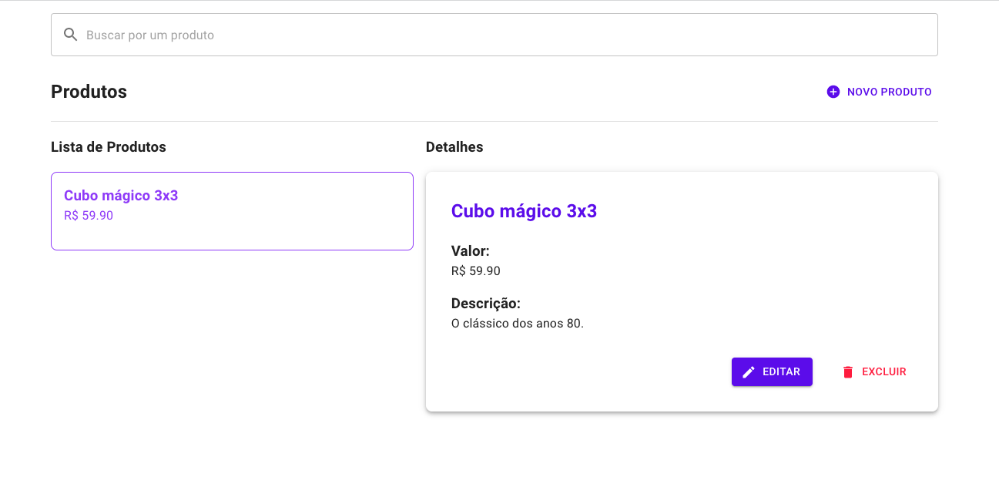

# RadarFit - Missão frontend

Projeto desenvolvido para desafio técnico da RadarFit,
cujo objetivo era criar um **frontend** que consumisse
uma API JSON Restful em Node, cujo código está [nesse repositório](https://github.com/luacomacento/radarfit-backend).

A página foi desenvolvida com **Next.js**, através do [create-next-app](https://github.com/vercel/next.js/tree/canary/packages/create-next-app),
e utiliza a biblioteca [MUI (Material UI)](https://mui.com/pt/) para estilização.

Conta ainda com responsividade para diversas telas, e possui o foco ``mobile-first``.

## Demonstração



## Deploy

O deploy do projeto foi feito através da plataforma Vercel
e pode ser acessado através [deste link](https://radarfit-frontend.vercel.app/).

## Rodando localmente

Clone o projeto

```bash
  git clone git@github.com:luacomacento/radarfit-frontend.git
```

Entre no diretório do projeto

```bash
  cd radarfit-frontend
```

Instale as dependências

```bash
  npm install
```

Inicie o servidor de desenvolvimento

```bash
  npm run dev
```

**Ou então** realize o build e depois inicie o servidor de produção

```bash
  npm run build && npm start
```

Abra [https://localhost:3000](https://localhost:3000) no seu navegador para visualizar.

## Variáveis de Ambiente

Para rodar esse projeto,
você vai precisar adicionar a seguinte variável de ambiente no seu ``.env.local``:

`NEXT_PUBLIC_API_URL`: link para a API do backend

## Autores

- [@luacomacento](https://www.github.com/luacomacento)

